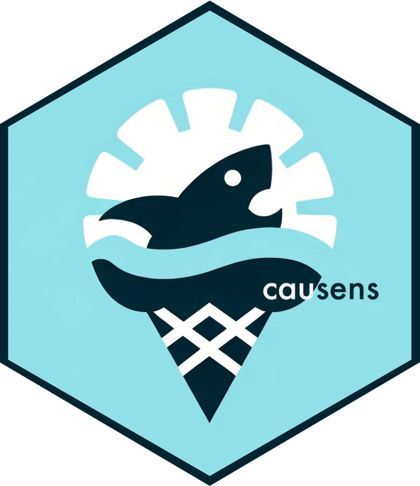

# causens <a href="https://kuan-liu-lab.github.io/causens/">  </a>

<!-- badges: start -->
  [](https://github.com/Kuan-Liu-Lab/causens/actions/workflows/R-CMD-check.yaml)
  [](https://codecov.io/gh/Kuan-Liu-Lab/causens?branch=main)
<!-- badges: end -->

_Why is it that more shark attacks occur when more ice cream is sold? The answer: both are related to the weather, here an unmeasured confounder._

## Overview

causens is an R package that will allow to perform various sensitivity
analysis methods to adjust for unmeasured confounding within the context of 
causal inference.

## Installation

```{r}
install.packages("devtools")
library(devtools)
devtools::install_github("Kuan-Liu-Lab/causens")
library(causens)
```

## Quickstart

``` r
library(causens)

# Simulate data
data <- simulate_data(N = 10000, seed = 123, alpha_uz = 1,
                      beta_uy = 1, treatment_effects = 1)

# Treatment model is incorrect since U is "missing"
causens(Z ~ X.1 + X.2 + X.3, data, "Z", "Y", method = "Li", c1 = 0.25, c0 = 0.25)
```

## Citing

Please cite our software using:

```
@Manual{,
  title = {causens: Perform causal sensitivity analyses using various statistical methods},
  author = {Larry Dong and Yushu Zou and Kuan Liu},
  year = {2024},
  note = {R package version 0.0.1, https://github.com/Kuan-Liu-Lab/causens},
  url = {https://kuan-liu-lab.github.io/causens/},
}
```

## Getting help

Please report bugs by opening an
[issue](https://github.com/Kuan-Liu-Lab/causens/issues/new). If you have
a question regarding the usage of `causens`, start a
[discussion](https://github.com/Kuan-Liu-Lab/causens/discussions/new/choose).
