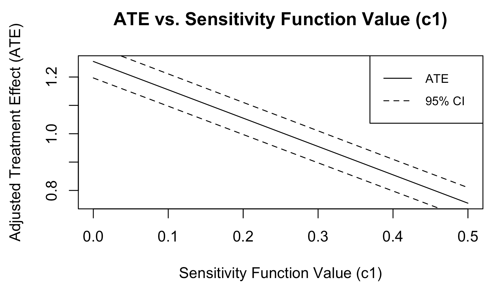

# Summary

While data from randomized experiments remain the gold standard for causal inference,
estimation of causal estimands from observational data is possible through various
confounding adjustment methods. However, the challenge of unmeasured confounding remains 
a concern in causal inference, where failure to account for unmeasured confounderes can 
lead to biased estimates of causal estimands. Sensitivity analysis within the framework of causal inference can help adjust for possible unmeasured confounding. Depending on the adjustment method, different modelling techniques or implicit assumptions can be necessary. 

To this end, we introduce `causens`, an R package for causal sensitivity analyses methods.
In `causens`, three main methods are implemented: adjustment via sensitivity
functions [@brumback2004sensitivity; @li2011propensity], Bayesian parametric modelling and 
Monte Carlo approaches [@mccandless2017comparison]. Many of these methods are not available
in a ready-to-use format nor subjected to unit testing.

# Statement of need

Existing R packages offer different causal sensitivity analysis adjustment methods:

- `causalsens`: In this package, a sensitivity function approach building on[@brumback2004sensitivity] is taken. In particular, the package emphasizes on [@blackwell2014selection].
  by looking at the degree of unexplained variance in modelling potential outcomes to guide the choise of sensitivity function.
- `sensitivitymv` and `sensitivitymw`: These packages implement methods from [@rosenbaum2007sensitivity] in which various test statistics obtained from a matching process are used to evaluate the extent of unmeasured confounding in an observational dataset.
- `konfound`: The `konfound` package allows users to input results from their causal analysis and settings under which the study was performed. The package primarily provides methods along two school of thoughts: Impact Threshold of a Confounding Variable [@narvaiz2024konfound] and Robustness of Inference to Replacement [@frank2013would].

While these aforementioned packages provide valid methods for causal sensitivity analysis, they do not cover all the methods available in the literature. In `causens`, we attempt to bridge the gap
by other sensitivity analyses approaches and some simulation settings that justify their use via unit tests. The latter can highlight the robustness of the methods implemented and provide a benchmark for future development, which would play well into the `causens` ecosystem.

# Currently Implemented Methods

## Adjustment via Sensitivity Functions

- Extra ingredient: knowledge of sensitivity function via domain expertise

A sensitivity function in the context of causal inference is the expected potential outcome
given the treatment status and the observed covariates:
\begin{align*}
  c(z, e) = E[Y(z) | Z = 1, e(X) = e] - E[Y(z) | Z = 0, e(X) = e]
\end{align*}
where $Y(z)$ is the potential outcome under treatment status $z \in \{0, 1\}$ and $e(X)$ is the probability of observing the observed treatment. Under the assumption of no unmeasured confounding, potential outcomes are independent of the treatment status given the observed covariates and
$c(z, e) = 0$ for all $z, e$.

Here is a quickstart that uses this method:

```r
library(causens)

# Simulate data
data <- simulate_data(N = 10000, seed = 123, alpha_uz = 0.5,
                      beta_uy = 0.2, treatment_effects = 1)

# Sensitivity function method
result <- causens(Z ~ X.1 + X.2 + X.3, "Y", data = data, method = "sf",
                  c1 = 0.25, c0 = 0.25)
result$estimated_ate
# 1.005025
```

From [@brumback2004sensitivity], their general guideline in specifying $c(z, e)$ considers sub-populations and their potential outcomes under treatment $z$. The assumption $c(z, e) > 0$ implies that individuals with an observed $Z = z$ have better $Y(1)$ than those under $Z = 1 - z$. Conversely, $c(z, e) < 0$ implies the opposite. To visually assess the influence of $c(z, e)$, one can plot the sensitivity function using the `plot_causens` function.

```r
plot_causens(
    trt_model,
    data,
    "Y",
    c1_upper = 0.5,
    c1_lower = 0,
    r = 1,
    bootstrap = TRUE
  )
```


## Bayesian Parametric Modelling

- Extra ingredient: Modelling assumptions for unmeasured confounder

In the Bayesian framework, the unmeasured confounder can be explicitly modelled. An important
distinguishing factor to the previous method based on sensitivity functions is that the problem
setting must allow $U$ to be feasibly modelled by $X$. In turn, this method can useful when
it is more sensible to model $U$ rather than posit a sensitivity function.

```r
library(causens)

# Simulate data
data <- simulate_data(N = 1000, seed = 123, alpha_uz = 0.5, beta_uy = 0.2, 
                      treatment_effects = 1, informative_u = TRUE)

result <- causens(Z ~ X.1 + X.2 + X.3, "Y", data = data, method = "Bayesian")
result$estimated_ate
```

Notice the `informative_u = TRUE` argument in the `simulate_data` function that simulates $U$ based on observable confounding variables $X$, which is a necessary condition in modelling unmeasured variables in a cross-sectional setting.

## The Monte Carlo Approach

The Monte Carlo approach is a simulation-based method that can be used to estimate the causal effect
of a treatment in the presence of unmeasured confounding. The method iteratively simulates via
repetitive sampling of the effect of the unmeasured confounder on the outcome and the treatment.

```r
library(causens)

# Simulate data
data <- simulate_data(N = 1000, seed = 123, alpha_uz = 1, beta_uy = 1, 
                      treatment_effects = 1)

# Sensitivity function method
result <- causens(Z ~ X.1 + X.2 + X.3, "Y", data = data, method = "Monte Carlo")
result$estimated_ate
# 0.9929688
```

A limitation in the Monte Carlo approach is that it is restricted to binary outcomes.

# Conclusion

We developed the `causens` R package to provide implementations of causal sensitivity analysis methods. The package is designed to be user-friendly, encapsulating some complexity under the hood while necessiting user-specification of important ingredients in adjustment methods. The package is also designed to be extensible, allowing for the addition of new methods in the future.

# References
